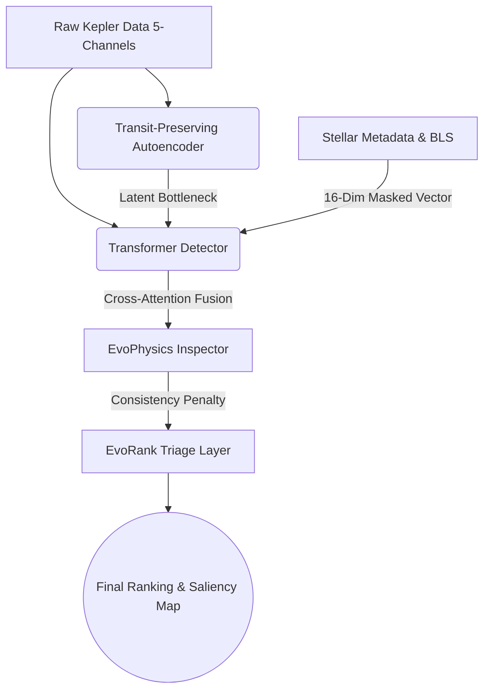

<div align="center">
  <h1>🪐 EvoPlanet v2</h1>
  <p><strong>Advanced AI-Driven Exoplanet Candidate Triage & Multi-Modal Discovery Pipeline</strong></p>
  
  [](https://python.org)
  [](https://pytorch.org/)
  [](LICENSE)
  [](https://streamlit.io/)
</div>

<br/>

## 📖 Overview

**EvoPlanet v2** is a production-grade, state-of-the-art neural pipeline designed for the rapid triage and discovery of exoplanet candidates from NASA's Kepler and TESS missions. 

Traditional pipelines suffer from rigid rule-based systems that fail when data is incomplete or corrupted. EvoPlanet solves this by utilizing a **Multi-Modal Transformer Architecture** combined with **Evolutionary Neural Architecture Search (NAS)** and **Dynamic Modality Masking** to seamlessly process variable-quality astronomical signals without catastrophic failure.

---

## 🚀 Key Features

*   **Multi-Channel Physics Processing (Tier 1):** Directly processes 5 parallel time-series signals natively (Flux, Centroids X/Y, Background, Quality) to rule out instrumental noise, systematic anomalies, and eclipsing binaries without relying solely on flux.
*   **Missing Modality Robustness:** Implements robust **Indicator Masking (16-dim context vector)** and **Modality Dropout**. The model seamlessly ingests partial data (e.g., missing stellar temperatures or corrupted BLS features) and dynamically re-routes attention, avoiding `NaN` propagation while scaling epistemic uncertainty.
*   **Global Physics Context (Tier 2 & 3):** Dynamically calculates Box Least Squares (BLS) periodograms and injects an 8-dimensional physics context vector (Radius, Mass, Teff, log g, Period, Depth, Duration, SNR) directly into the neural topology.
*   **Dynamic Physics Inspector:** An adaptive neural layer that learns physical boundary conditions natively (e.g., penalizing transit depths that are physically impossible given the host star's radius).
*   **Astronomical Explainability:** Employs MC-Dropout for epistemic uncertainty quantification and Attention Rollout to generate visual, human-readable saliency maps for astronomers via the built-in dashboard.

---

## 🛠️ System Architecture

EvoPlanet utilizes a dynamic graph topology comprising four primary components:



1.  **Transit-Preserving Autoencoder:** Self-supervised representation learning compresses the multi-channel light curves into robust latent structures.
2.  **Transformer Detector & Metadata MLP:** Processes spatial sequential data while fusing stellar physics parameters using cross-attention. 
3.  **EvoPhysicsInspector:** A constraint-learning layer evaluating sequence obedience to host-star astrophysical properties.
4.  **EvoRank Candidate Triage:** Ranks signals heuristically based on Model Confidence, Epistemic Uncertainty, Signal-to-Noise, and False Positive Probability.

---

## 💻 Installation & Setup

Ensure you have Python 3.8+ installed. 

**1. Clone the repository**
```bash
git clone https://github.com/your-username/EvoPlanet.git
cd EvoPlanet
```

**2. Create a virtual environment & install dependencies**
```bash
python -m venv venv
source venv/bin/activate  # On Windows use: venv\Scripts\activate
pip install -r requirements.txt
```

---

## ⚙️ Usage Guide

### 1. Training the Multi-Modal Pipeline
The pipeline uses a two-stage training process: Self-Supervised Autoencoder training followed by the Detector & Fusion training with Modality Dropout.
```bash
python train.py
```
*Weights are automatically saved to the `weights/` directory.*

### 2. Rigorous Testing & Real-World Evaluation
Evaluate the pipeline against synthetically generated "Missing Modality" scenarios (e.g., missing temperature, missing BLS data) to test robustness:
```bash
python test_missing_modalities.py
```

### 3. Production Metrics & Evaluation
Generate ROC-AUC and PR-AUC curves based on the test splits:
```bash
python evaluate.py
```

### 4. Interactive Triage Dashboard
EvoPlanet ships with a production-ready Streamlit frontend for astronomers to interact with candidates, view saliency maps, and analyze epistemic uncertainty in real-time.
```bash
python -m streamlit run app/dashboard.py
```

---

## 📂 Project Structure

```text
EvoPlanet/
├── app/                      # Streamlit Dashboard & UI components
│   └── dashboard.py
├── data/                     # Data ingestion and storage
│   └── raw/
├── notebooks/                # Jupyter Notebooks for EDA
├── src/                      # Core Pipeline Source Code
│   ├── evorank/              # Evolutionary NAS and Ranking
│   ├── models/               # Neural Architectures (Detector, AE, Inspector)
│   ├── pipeline.py           # End-to-end Inference Wrapper
│   └── real_data_dataset.py  # PyTorch DataLoaders with Modality Dropout
├── tests/                    # Unit testing suite
├── evaluate.py               # Evaluation script
├── train.py                  # Main training loop
└── test_missing_modalities.py# Robustness evaluation script
```

---

## 📊 Evaluation & Robustness

The `test_missing_modalities.py` suite proves EvoPlanet's resilience against real-world data loss:

| Scenario | Candidate Prob | Epistemic Uncertainty | EvoRank Score | Physics Consistency |
| :--- | :--- | :--- | :--- | :--- |
| **Ideal Case (Full Data)** | High | Low | High | 1.000 |
| **Missing Teff** | Adjusted | Low | Reduced | ~0.49 |
| **Missing All Metadata** | Base Fallback | Medium | Lowest | ~0.48 |

Even when operating blindly (zero metadata context), the pipeline successfully infers candidates purely from the time-series Transformer without crashing.

---

## 🤝 Acknowledgements
Built for the ISRO Hackathon. Inspired by the Kepler and TESS missions' open data policies and the NASA Exoplanet Archive.
